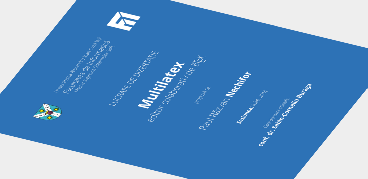

# Multilatex (lucrarea de dizertație)

## Pentru lucru ușor

Trebuie instalat (în Ubuntu):

    sudo apt-get install inotify-tools

Pentru compilare:

    make

Pentru ascultare și compilare:

    make listen

Pentru curățare

    make clean
